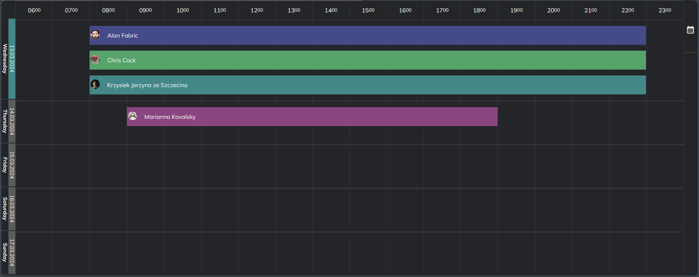

## VuelCalendar
This Vue Calendar is a versatile calendar search tool akin to V-Calendar, designed for efficient schedule management and event allocation along a horizontal timeline. It offers a range of features facilitating the manipulation, deletion, modification, and addition of events, along with configurations for timeline styling and date ranges.

This calendar tool serves as a robust platform for organizing events and managing time efficiently. Users can seamlessly navigate through dates, allocate events with precision, and customize the display to suit their specific needs. Whether it's for personal scheduling, project management, or team coordination, VuelCalendar provides a user-friendly interface coupled with powerful functionalities.

Key features of VuelCalendar include:

- Event Management: Users can effortlessly add, edit, move, and delete events directly on the timeline, streamlining the process of organizing schedules.

- Customizable Timeline: The timeline display can be configured to accommodate different date ranges, time intervals, and styles, ensuring flexibility in visualizing schedules.

- Date Range Selection: Users can specify date ranges to focus on specific periods, making it easier to manage schedules within desired timeframes.

- Configurable Event Properties: Users can define various properties for events, such as title, description, duration, and color coding, for enhanced organization and clarity.

- Integration Capabilities: VuelCalendar can be integrated with other applications and platforms, allowing for seamless data exchange and collaboration.




https://www.npmjs.com/package/vuelcalendar

https://github.com/cybeq/VuelCalendar


**Updated  15.03.2024 | 19:42 | Read about new features at the end of the document -> v.0.2**

## How to Use

:point_down:
```js
npm install vuelcalendar
```
:point_up_2:

### Vue
````html
<section class="w-[800px]">
   <VuelCalendar :vuelCalendarOptions="vuelCalendarOptions" :colors="colors" ></VuelCalendar>
</section>
/* These settings will cause the calendar to extend the document downward when expanding the timeline downwards. */
````
````html
<section class="w-[800px] max-h[600px] overflow-auto">
   <VuelCalendar :vuelCalendarOptions="vuelCalendarOptions" :colors="colors"></VuelCalendar>
</section>
/* 
If you enforce height through styling, you must also set overflow!!.
This prevents your document from expanding, allowing the calendar to be extendable downwards. 
However, remember!
You must set the maximum height equal to the height parameter for the calendarOptions object. 
This is crucial for the correct functioning of the calendar. 
*/
````

### TS/JS Object
#### COMPOSITION API
```ts
const calendarApi = ref<IVuelCalendarApi | undefined>(undefined);

const vuelCalendarOptions = ref<IVuelCalendarOptions>({
    height:600, /* The initial height of the calendar*/
    theme:'dark', /* 'dark' and 'light' theme available */
    startDate:new Date(), /* Define the first day being displayed on the calendar */
    daysForward:5, /* Minimum 1, this parameter defines how many days after the start day should be displayed */
    startHour:17, /* Minimum 0, Max 23, define time from 'startHour' to 23:59 */
    renderer:'ExampleRender', /* example vue component to use as renderer for event container (read about Renderers below)*/,
    draggableEvents:true, /* set if you want to implement draggable events -> onEventDropped(drop:VuelCalendarDrop) -< then implement this method to catch dropped events on timeline */
    onVuelCalendarApiReady: (api: IVuelCalendarApi) => {
        calendarApi.value = api;
        api.setEvents([
            {
                id: 1,
                label: 'Event #1',
                data: {},
                start: new Date(new Date().setHours(8, 0)),
                end: new Date(new Date().setHours(23, 0)),
            },
        ]); /* after API is ready you can set new Events to the calendar */
    },
    onDayClicked:(day:VuelCalendarDay)=>
    {
        /* The function returns the day that was clicked, along with the time and date on the timeline, as well as the events that belong to this day.*/
    },
    onEventClicked:(event:VuelCalendarEvent)=>
    {
        /* The function returns the event that was clicked, along with the time and date of start and end, as well as the data:any that belong to this event.*/
    },
    onEventDropped:(event:VuelCalendarDrop)=>
    {
        /* property draggableEvents must be set to true in VuelCalendarOptions */
        /* The function returns the drop object(VuelCalendarEvent&VuelCalendarDay&MousEvent) that was being dragged, along with the time and date on timeline.*/
    },
});
```

#### OPTIONS API
```ts
import VuelCalendar from 'vuelcalendar';
import type {IVuelCalendarApi, VuelCalendarOptions, VuelCalendarEvent, VuelCalendarDay} from 'vuelcalendar';

calendarApi: {} as any, /* options api fix for this type will be available in the futue, now its recommended to use it as any */
calendarOptions:{
        height:600, /* The initial height of the calendar*/
        theme:'dark', /* 'dark' and 'light' theme available */
        startDate:new Date(), /* Define the first day being displayed on the calendar */
        daysForward:5, /* Minimum 1, this parameter defines how many days after the start day should be displayed */
        startHour:17, /* Minimum 0, Max 23, define time from 'startHour' to 23:59 */
        renderer:'ExampleRender', /* example vue component to use as renderer for event container (read about Renderers below)*/
        draggableEvents:true, /* set if you want to implement draggable events -> onEventDropped(drop:VuelCalendarDrop) -< then implement this method to catch dropped events on timeline */
        onVuelCalendarApiReady:(api:any)=>{
          this.calendarApi = api;
          api.setEvents( [
            {
              id:1,
              label:'Event #1',
              data:{},
              start:new Date(new Date().setHours(8, 0)),
              end:new Date(new Date().setHours(23, 0)),
            }
          ]) /* after API is ready you can set new Events to the calendar */
        },
        onDayClicked:(day:VuelCalendarDay)=>
        { 
            /* The function returns the day that was clicked, along with the time and date on the timeline, as well as the events that belong to this day.*/
        },
        onEventClicked:(event:VuelCalendarEvent)=>
        {
           /* The function returns the event that was clicked, along with the time and date of start and end, as well as the data:any that belong to this event.*/
        },
        onEventDropped:(event:VuelCalendarDrop)=>
        {
            /* property draggableEvents must be set to true in VuelCalendarOptions */
            /* The function returns the drop object(VuelCalendarEvent&VuelCalendarDay&MousEvent) that was being dragged, along with the time and date on timeline.*/
        },
```
# API functions

### Change timeline start date

-------------------------

```ts 
calendarApi!.setDate(date);
```
- date: Type of **Date**

**This function is responsible for changing the startDate to a new date. If you change this date, your timeline will set the initial date to this date.**


---------------------------
### Change timeline start hour

-------------------------

```ts 
calendarApi!.setStartHour(hour);
```
- hour: Type of **Number** [min:0, max: 23]

**This function is responsible for changing the startHour to a new hour. If you change this hour, your timeline will set the initial hour to this hour.**


---------------------------

### Set date range 

-------------------------

```ts 
calendarApi!.setDateRange(startDate:Date, endDate:Date);
```

**This function is responsible for  setting a specific date range on calendar**


---------------------------

### Set days forward

-------------------------

```ts 
calendarApi!.setDaysForward(days:Number);
```
days: Type of **Number** [min:1] = 1 means a one day on timeline
**This function is responsible for  setting a days forward on time line**


---------------------------
### Switch view mode ( days <=> month )

-------------------------

```ts 
calendarApi.switchViewMode();
```

**This function is responsible for switching the calendar view mode from daily to monthly and vice versa.**


---------------------------

### Set new events

```ts 
calendarApi.setEvents(events);
```
- events: Type of **VuelCalendarEvent**

**This function is responsible for deleting old events and replacing them with new ones.**

---------------------------
### Pushing events

```ts 
calendarApi.addEvents(events);
```
- events: Type of **VuelCalendarEvent**

**This function is responsible for adding new events to the current ones.**

---------------------------

### Remove events by param

```ts 
calendarApi.removeEventsByParam(param, value);
```
- param: Type of **String**
- value: Type of **any**

**This function is responsible for removing the selected event. For example, by sending the parameter string 'id' with the value 5, we will remove the event with id === 5**
````js
calendarApi.removeEventsByParam('id', 5);
/* event with id 5 has been removed */
````
---------------------------
### Edit events by param

```ts 
calendarApi.configureEventsByParam(param, value, object);
```
- param: Type of **String**
- value: Type of **any**
- object: Type of **VuelCalendarEvent**

**This function is responsible for finding the event with the specified parameter and value, and then replacing the values for that parameter. For example, if we insert 'id' in the parameter, 5 in the value, and {start: todaysDate, end: todaysDatePlus2Hours, data: {employees: listOfEmployees}} in the object, then in the event with id 5, the start and end dates will be changed, and the object data of any type will be assigned a list of employees.**

````ts
calendarApi.configureEventsByParam(
    'id', 5, 
        {
           start:startDate, 
           end:endDate, 
           data:{
             employees:[]
           }
        })
/* params has been changed to event id === 5 */
````

------------------


# Features and updates
### 15.03.2024 | 19:45
- Tiny borders style modification + calendarApi.setViewMode() method included, ugly bar removed.


### 13.03.2024 | 21:15
1. Drag & Drop Functionality 
- Example usage:
```js
vuelCalendarOptions: {
...
draggableEvents:true
}
```
```js
onEventDropped:(event:VuelCalendarDrop)=>
{
    /* property draggableEvents must be set to true in VuelCalendarOptions */
    /* The function returns the drop object(VuelCalendarEvent&VuelCalendarDay&MousEvent) that was being dragged, along with the time and date on timeline.*/
}
```
### 13.03.2024 | 16:00
1. A parameter 'Renderer' has been added to the VuelCalendarOptions object.
- This is a component that allows using a custom component inside an event container.
- Example usage:
```js
/* main.ts */
app.component('ExampleRenderer', ExampleRenderer)
```
```js
vuelCalendarOptions: {
...
renderer:'ExampleRenderer'
}
```
```js
/* ExampleRenderer.vue */
export default defineComponent({
  name:"ExampleRenderer",
  props:{
    event:{
      type:Object as PropType<VuelCalendarEvent>,
    } /* this the full Event<VuelCalendarEvent> object passed to your rendering component */
  }
})
</script>

<template>
<div :style="`min-height:50px; background:${event.data.color}; display:flex; padding-inline:3px; align-items:center`">
 <div>
   
 </div> 
 <p>
   {{event.label}}
 </p>
</div>
</template>

```
### 12.03.2024 | 20:40
1. Performance improvements were achieved by decomposing into multiple components and relieving the DOM tree through standardizing functions and incorporating them into computed properties.

2. ***Classes*** for DOM elements to make theme more customizable has been added

3. Added the Colors prop, which defines colors for theme styles as parent entities.
```ts
export type Colors = {
    surface?:string;
    primary?:string
    event?:string
    highlight?:string
    textPrimary?:string
    menuBg?:string,
    dragging?:string,
}
```
4. Types included
# Upcoming features

1. Lazy loading for events within the container.

2. Calendar rotation for choosing between two modes: Horizontal (current) and Vertical.

3. More performance improvement

4. ~~Drag & Drop~~ <- 13.03.2024
5. Time bar following the mouse